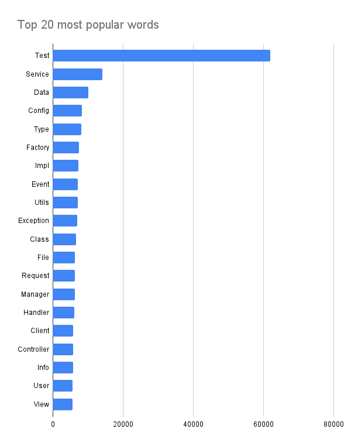
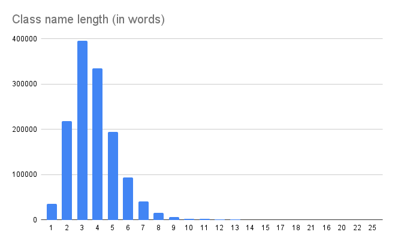

# Java Class Name Word Popularity Analyzer

This project analyzes Java class names in GitHub repositories and determines the popularity of words in those class names. The program retrieves Java-based repositories from GitHub, processes the class names, and outputs the most frequently used words and word count,  with the ability to sort and filter the results.

## Features

- Retrieve Java-based repositories from GitHub using the GitHub API.
- Analyze class names in .java files to extract word frequency data.
- Process large datasets concurrently using Kotlin coroutines for speed and scalability.
- Sort and rank words by frequency, collecting the top N most common words.
- Output the results to a file for further analysis or reporting.

## Requirements

- Kotlin 1.5+
- GitHub API token (for accessing GitHub data)
- JDK 11+
- Internet connection (to access GitHub repositories)

## Setup

1. **Clone the repository**:

   ```bash
   git clone https://github.com/yourusername/kotlin-classname-analyzer.git
   cd kotlin-classname-analyzer
   ```

2. **Set up the GitHub API token**:
   - To use the GitHub API, you need a personal access token. You can create one [here](https://github.com/settings/tokens).
   - Set the token in the `GITHUB_TOKEN` environment variable.

3. **Install dependencies**:
   This project uses Kotlin, and you'll need a Kotlin-capable build system like Gradle or Maven. Here's how you can build it using Gradle:

   ```bash
   ./gradlew build
   ```

4. **Run the application**:

   To run the program, use:

   ```bash
   ./gradlew run

## Execution

This program fetches the most popular Java repositories on GitHub using **GitHub Search API** and analyzes class names from them. Repositories are sorted by stars and their number can be configured. Given the limitations of the GitHub Search API maximum number of repositories that can be returned from one query is 1000.

Only valid Java class names are considered. This is checked using ```SourceVersion.isIdentifier()``` method.

Class name processing is done concurrently using Kotlin coroutines. Jobs are automatically divided according to the configured repository count. Processing is implemented based on Map-Reduce principle.

## Results

- Program outputs two files. 
- First one is ```most_common_words.txt``` and it represents a Map like structure where each row contains one camel case word and number of occurrences.
- Second file represents results of analyzing word count of each class name.

In this example we have analyzed top 1000 repositories sorted by stars. In those repositories there was 1339950 valid Java class names.
Here are the results of the analysis(only top 20 words are shown). Full result map can be found in the .txt file.



## Author
- [Danilo Cvijetic](https://github.com/c-danil0o)
